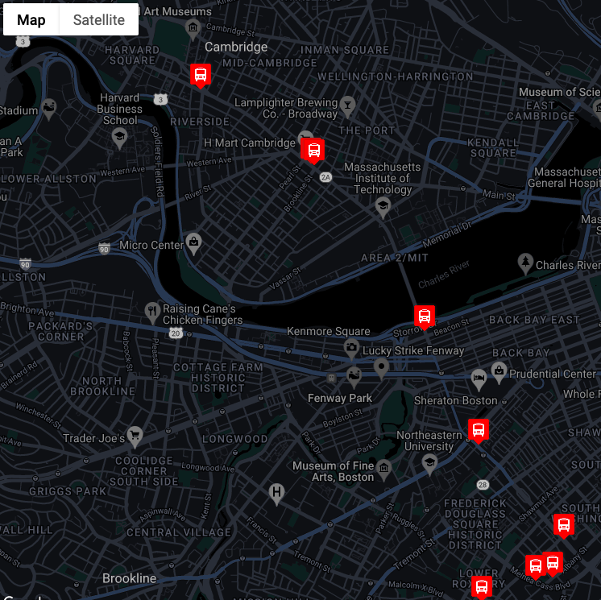

# Real-Time-Bus-Tracker

 

# About:

 [Click here to see the Real Time Bus Tracker in action.](https://rainakpuels.github.io/Real-Time-Bus-Tracker)

This is an exercise developed during MIT xPro Full Stack Professional Certificate in Coding.

Using Google Maps API, MBTA API, JavaScript, CSS, and HTML, we created a "Real Time Bus Tracker" that uses data from the MBTA to track the live locations of its Route 1 busses. It updates every 10 seconds.

This code uses asynchronous functions, the "await" operator, and promises.

# How to Run

You will need to sign up for Google Maps API to get your own key. You will input this into the index.html file. Additionally, you can create a style for your map through Google and append it to a Map ID, which you can input that into the mapanimation.js file.  

# Roadmap of Future Improvemenets

No further development is expected.

# Liscence Information 

[MIT License](https://github.com/rainakpuels/Real-Time-Bus-Tracker/blob/default/LICENSE)
